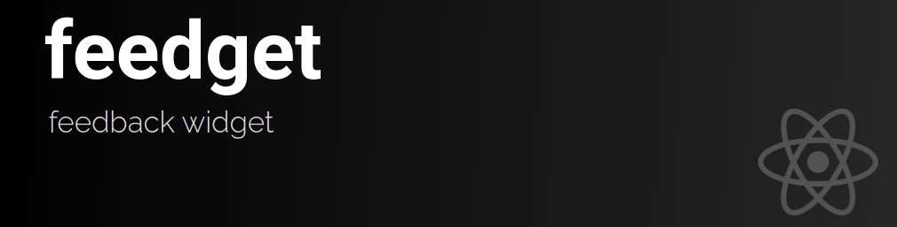
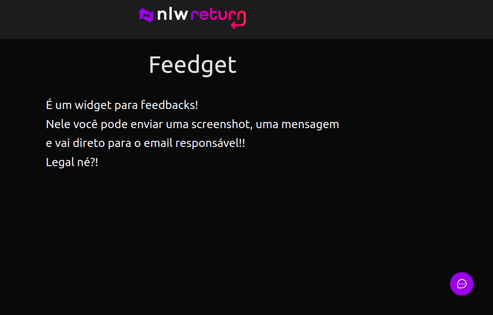
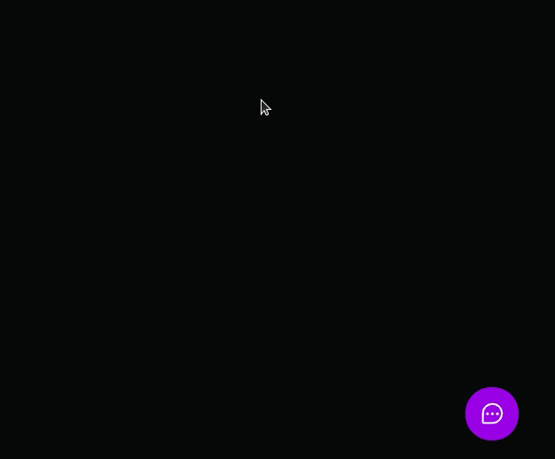

 

# :pushpin: Index
- [About](#monocle_face-about)
- [Project Media](#camera_flash-project-media)
- [Technologies](#rocket-technologies)
- [Author](#closed_book-author)
 

---

# :monocle_face: About
Project developed to practice the integration of React with Vercel, Mailtrap and Railway.

In it you send feedback, being able to take screenshot of the screen.

Hope you like it :D

## [See it online!!](https://feedget-two-swart.vercel.app/)
 

---

# :camera_flash: Project Media

 

---

# :rocket: Technologies
This project was developed with the following technologies:  

  ## Front-end
    - :heavy_check_mark: **React**
    - :heavy_check_mark: **TypeScript**
    - :heavy_check_mark: **Tailwind CSS**
    - :heavy_check_mark: **Jest/React Testing Library**
    - :heavy_check_mark: **Axios/SWC**
    - :heavy_check_mark: **ESLint**
    - :heavy_check_mark: **Prettier**

  ## Back-end
    - :heavy_check_mark: **Node**
    - :heavy_check_mark: **TypeScript**
    - :heavy_check_mark: **Prisma**
    - :heavy_check_mark: **Jest**
    - :heavy_check_mark: **Express/Nodemailer/Cors**
  
 

---

# :closed_book: Author
Patrick Morais  
 
 
